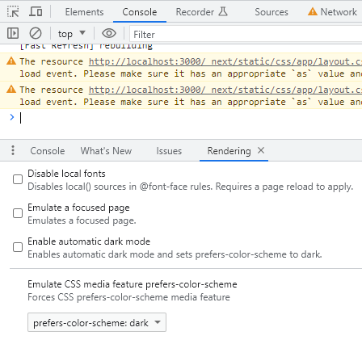

# INFO

## TODO

- [ ] Sort Tailwind classes
- [ ] Check TODO:s
- [ ] Check Any:s

## Known issues

- [ ] DynamicServerError: Dynamic server usage: Page couldn't be rendered statically because it used `cookies`. [See more info here](https://nextjs.org/docs/messages/dynamic-server-error)
  - import { revalidatePath } from "next/cache";

## Links

- TAILWIND
  - [Tailwind CSS](https://tailwindcss.com/)
  - [Cheat Sheet](https://tailwindcomponents.com/cheatsheet/)
  - [unknownAtRules Warnings From Tailwind CSS](https://www.codeconcisely.com/posts/tailwind-css-unknown-at-rules/)
  - [Tailwind Elements](https://tailwind-elements.com/)
- SUPABASE
  - [Supabase](https://supabase.com/)
  - [auth-api](https://supabase.com/docs/reference/javascript/auth-api)
  - [Auth helpers](https://supabase.com/docs/guides/auth/auth-helpers/nextjs)
  - [CLI TypeScript](https://supabase.com/docs/reference/javascript/typescript-support)
- OTHER
  - COMPONENTS
    - [Material UI](https://mui.com/material-ui/)
    - [Shadcn UI](https://ui.shadcn.com/)
    - [Chakra UI](https://chakra-ui.com/)
  - [React component as prop](https://www.developerway.com/posts/react-component-as-prop-the-right-way)
  - [Zustand slices](https://github.com/pmndrs/zustand/blob/main/docs/guides/slices-pattern.md)
  - [Clerk authentication](https://clerk.com/)
  - [Iconify](https://iconify.design/)
  - [Hero Icons](https://heroicons.com/)
  - [Favicon](https://realfavicongenerator.net/)
  - [SWR](https://swr.vercel.app/)

## Supabase CLI

```sh
npm i supabase --save-dev
npx supabase login
npx supabase gen types typescript --project-id yeebxkyqwarhmbfpkgir > "./src/lib/database.types.ts"
```

## Miscellaneous

### Test dark mode in Chrome

Developer tools, ... to the right, select `Show Console Drawer`, select `Rendering`, select `Emulate CSS media feature` prefer-color-scheme.


